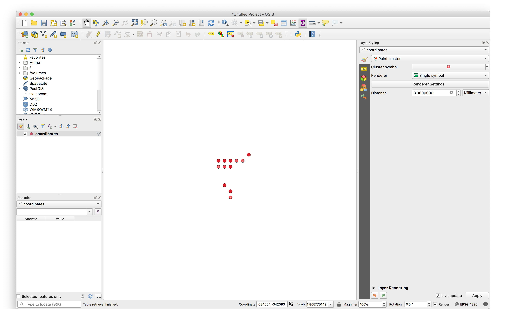
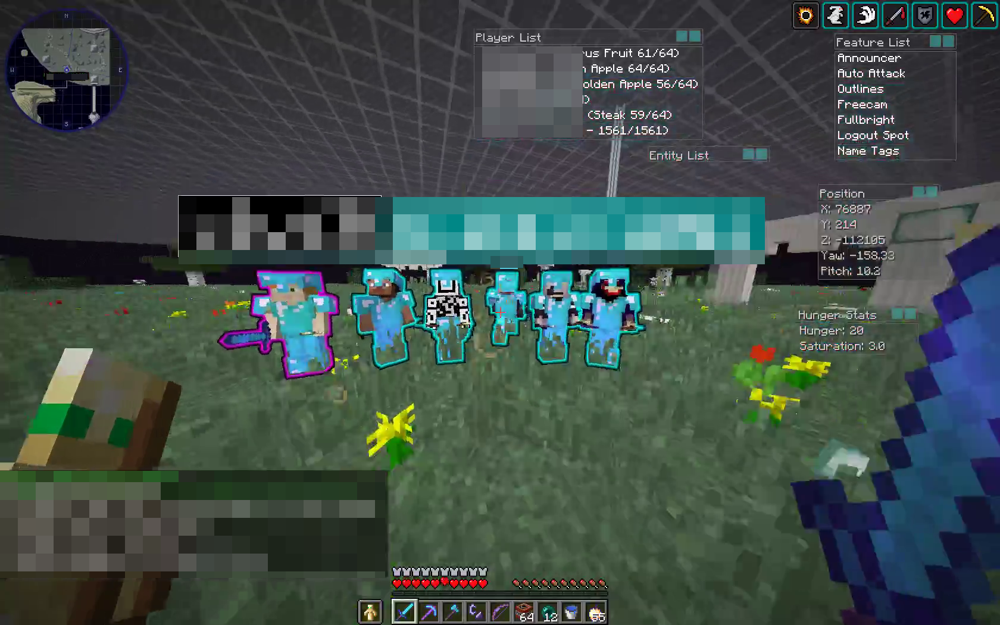

autoscale: true
slidenumbers: true

# Using PostGIS and QGIS to Win Minecraft
## Rocky Breslow

---

# 3D Cartesian Coordinate System


---


---


---


---

# `CPacketPlayerDigging` (💻➡ serverbound)

| Field Name | Field Type    |
|------------|---------------|
| Status     | `VarInt Enum` |
| Location   | `Position`    |
| Face       | `Byte Enum`   |

---

# `SPacketBlockChange` (💻⬅️ clientbound)

| Field Name | Field Type |
|------------|------------|
| Location   | `Position` |
| Block ID   | `VarInt`   |

---

# Breaking Minecraft Server

```python
def send_player_digging(self, x, z):
    print ("ping: {} {}".format(x, z))

    self.send_packet("player_digging", self.buff_type.pack_varint(2),
                self.buff_type.pack_position(x, 0, z),
                self.buff_type.pack('b', 0))

def packet_block_change(self, buff):
    position = buff.unpack_position()
    block_id = buff.unpack_varint()
    
    x, y, z = position

    if(y == 0):
        print("pong: {} {}".format(x, z))
```

---


---


---


---


---

# Filtering out Junk

- No "highways"
- No "beginner" bases

```sql
SELECT *
FROM coordinates
WHERE ABS(ST_X(geom)) > 100000
  AND ABS(ST_Y(geom)) > 100000
  AND (ABS(ABS(ST_X(geom)) - ABS(ST_Y(geom))) > 100000
       OR ABS(ABS(ST_X(geom)) - ABS(ST_Y(geom))) < -100000)
```

---

# After Filtering


---

# Point Cluster


---

# Point Cluster


---

# Did we find someone?



---

# Is there a pattern?

```sql
SELECT found_time,
       ST_AsText(GEOM)
FROM coordinates
WHERE ST_Within(geom, ST_MakePolygon(ST_GeomFromText('LINESTRING(
                                                      683600 -342979, 
                                                      685400 -342979, 
                                                      685400 -341441, 
                                                      683600 -341441, 
                                                      683600 -342979)')))
ORDER BY found_time DESC
LIMIT 10
```

---

# Yup.

| "found_time"              | "st_astext"             | 
|---------------------------|-------------------------| 
| "2019-04-23 08:33:24.907" | "POINT(684720 -341856)" | 
| "2019-04-21 20:08:11.776" | "POINT(684288 -341856)" | 
| "2019-04-11 11:00:52.512" | "POINT(684720 -341856)" | 
| "2019-04-02 17:36:37.266" | "POINT(684864 -341856)" | 
| "2019-04-01 12:39:05.253" | "POINT(684864 -341856)" | 
| "2019-04-01 07:10:53.025" | "POINT(684720 -341856)" | 
| "2019-03-26 15:13:50.489" | "POINT(684864 -341856)" | 
| "2019-03-26 12:35:07.593" | "POINT(684864 -341856)" | 
| "2019-03-20 17:49:09.432" | "POINT(684864 -341856)" | 
| "2019-03-19 15:24:28.895" | "POINT(684576 -341856)" | 

---


---


---



---

# What's next?

- What other convienence can PostGIS provide for me?
- How can projections help me?
- If I store a list of who's online per hit, can I use that?